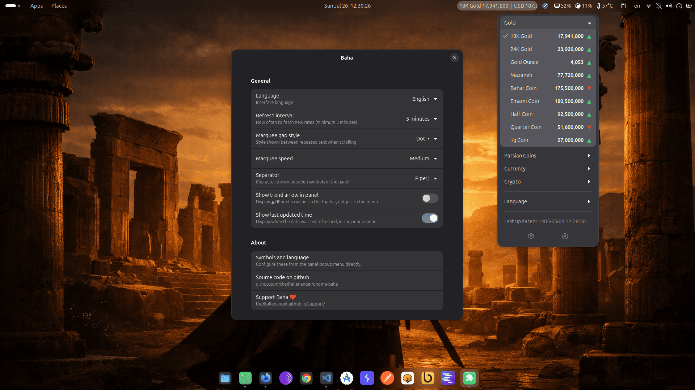
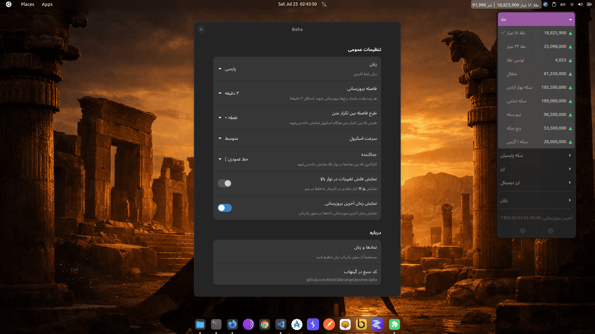

<div align="center">


# 💰 Baha — بها

/bahā/ (meaning "value" or "price" in Persian)

### Live gold, currency & crypto rates — right in your GNOME top bar

[](LICENSE)


**No ads. No tracking. No nonsense. Just the numbers you actually care about.**

[Install from GNOME Extensions](#-installation) · [Features](#-features) · [Screenshot](#-screenshot) · [مستندات پارسی](#persian-docs)

</div>

---

<div align="center">

### 🌐 Choose your language / زبان خود را انتخاب کنید

</div>

<details open>
<summary><b>🇬🇧 English Documentation</b></summary>

<br>

## Why Baha?

Tired of opening five different apps and tabs just to check the price of gold, the dollar, or Bitcoin? **Baha** puts that information exactly where you're already looking — your GNOME top bar — and gets out of your way.

No sign-ups. No bloated dashboards. No accounts to manage. Just glance up, and you know.

## ✨ Features

- 📊 **Live rates at a glance** — gold, coins, major currencies, and popular cryptocurrencies, always visible in your top bar.
- 🎯 **Pick exactly what you want** — choose any combination of symbols from a clean, organized menu. Show only what matters to you.
- 🔄 **Trend indicators** — instantly see whether a price is heading up ▲ or down ▼, both in the menu and optionally right in the panel.
- 🌗 **Fully bilingual** — a beautifully translated interface in both **English** and **پارسی**, switchable anytime with one click.
- 🎨 **Make it yours** — customize the scroll speed, the separator style, the gap pattern between repeated text, and how often data refreshes.
- 🪶 **Lightweight & unobtrusive** — a small, elegant marquee that only scrolls when it actually needs to, and stays out of your way otherwise.
- 🔒 **Privacy-respecting** — no accounts, no personal data collected, no tracking. Ever.
- 💸 **Completely free & open-source** — forever. Licensed under GPLv3.

## 📸 Screenshot

<div align="center">



</div>

## 📥 Installation

### Option 1 — GNOME Extensions website (recommended)

The easiest way to install Baha:

1. Visit the [Baha page on extensions.gnome.org](https://extensions.gnome.org/extension/10550/baha/)
2. Flip the switch to install
3. That's it — Baha now lives in your top bar

### Option 2 — Manual installation

If you'd rather install from source:

```bash
git clone https://github.com/the6fallenangel/gnome-baha.git
cd gnome-baha
cp -r . ~/.local/share/gnome-shell/extensions/gnome-baha@the6fallenangel.github.io
glib-compile-schemas ~/.local/share/gnome-shell/extensions/gnome-baha@the6fallenangel.github.io/schemas
gnome-extensions enable gnome-baha@the6fallenangel.github.io
```

Then log out and back in (or restart GNOME Shell on X11 with <kbd>Alt</kbd>+<kbd>F2</kbd> → `r` → <kbd>Enter</kbd>).

## 🖱️ Usage

Click the Baha indicator in your top bar to:

- ✅ Toggle any symbol on or off — see its current value right there in the menu, even before enabling it
- 🌐 Switch between English and Persian instantly
- ⚙️ Open full preferences for fine-grained control
- 🔗 Jump straight to this repository

## ⚙️ Preferences

Fine-tune Baha to match your taste:

| Setting              | Description                                               |
| -------------------- | --------------------------------------------------------- |
| **Refresh interval** | How often new rates are fetched (3–60 minutes)            |
| **Marquee speed**    | Slow, medium, or fast scrolling                           |
| **Gap style**        | The pattern shown between repeated text while scrolling   |
| **Separator**        | The character shown between symbols in the panel          |
| **Trend arrows**     | Show ▲/▼ indicators right in the panel, not just the menu |
| **Last updated**     | Show or hide the last-refresh timestamp in the menu       |

## 🤝 Contributing

Contributions, bug reports, and feature suggestions are always welcome! Feel free to open an issue or submit a pull request.

## ❤️ Support Baha

If you enjoy using Baha and want to support its continued development, you can help by making a donation.

Your support helps me keep improving Baha, adding new features, and maintaining the project.

[❤️ Support Baha](https://the6fallenangel.github.io/support/)

## 📄 License

Baha is free software, licensed under the [GNU General Public License v3.0](LICENSE).

</details>
<a id="persian-docs"></a>
<details>
<summary><b>☀️🦁 مستندات پارسی</b></summary>

<br>

## چرا بها؟

خسته شدی هر بار برای چک کردن قیمت طلا، دلار، سکه یا بیت‌کوین کلی تب و برنامه باز کنی؟  
**بها** همه این قیمت‌ها رو مستقیم توی نوار بالای گنوم نشون می‌ده. فقط یه نگاه به بالا بندازی، همه‌چی جلوی چشمت هست.

بدون ثبت‌نام، بدون تبلیغات؛ فقط اطلاعاتی که نیاز داری در یک نگاه بدون دردسر.

## ✨ ویژگی‌ها

- 📊 **قیمت‌های لحظه‌ای در نوار بالا** — طلا، سکه، ارزهای مهم و ارزهای دیجیتال محبوب همیشه در دسترس.
- 🎯 **انتخاب دلخواه** — فقط نمادهایی که برات مهم هستن رو نمایش بده، بقیه رو مخفی کن.
- 🔄 **نمایش روند قیمت** — فلش ▲ و ▼ افزایش و کاهش قیمت، هم توی منو و هم (اختیاری) توی نوار بالا.
- 🌐 **کاملاً دو زبانه** — رابط کاربری پارسی و انگلیسی، با یک کلیک عوض می‌شه.
- 🎨 **شخصی‌سازی بالا** — سرعت اسکرول، جداکننده، فاصله بین متن‌ها و زمان بروزرسانی رو خودت تنظیم کن.
- 🪶 **سبک و بدون لگ** — فقط وقتی متن جا نشه اسکرول می‌کنه وگرنه توی نوار ثابت می‌مونه.
- 🔒 **حریم خصوصی** — هیچ ردیابی، هیچ حساب کاربری، هیچ جمع‌آوری اطلاعاتی.
- 💸 **رایگان و اوپن‌سورس** — تحت لیسانس GPLv3، برای همیشه.

## 📸 اسکرین‌شات‌

<div align="center">



</div>

## 📥 نصب

### روش اول — از سایت رسمی GNOME Extensions (پیشنهادی)

ساده‌ترین راه برای نصب بها:

1. به [صفحه بها در extensions.gnome.org](https://extensions.gnome.org/extension/10550/baha/)
2. دکمه نصب رو بزن
3. تمام! بها از این به بعد توی نوار بالات هست.

### روش دوم — نصب دستی

اگر ترجیح می‌دهید از سورس نصب کنید:

```bash
git clone https://github.com/the6fallenangel/gnome-baha.git
cd gnome-baha
cp -r . ~/.local/share/gnome-shell/extensions/gnome-baha@the6fallenangel.github.io
glib-compile-schemas ~/.local/share/gnome-shell/extensions/gnome-baha@the6fallenangel.github.io/schemas
gnome-extensions enable gnome-baha@the6fallenangel.github.io
```

بعد از نصب یک‌بار از حساب خارج و دوباره وارد شو (یا در X11 با <kbd>Alt</kbd>+<kbd>F2</kbd> ← `r` ← <kbd>Enter</kbd> گنوم شل رو ریستارت کن).

## 🖱️ نحوه استفاده

روی بها در نوار بالا کلیک کن تا:

- ✅ هر نمادی رو فعال یا غیرفعال کنی (قیمت لحظه‌ای‌اش رو هم همونجا می‌بینی)
- 🌐 بین پارسی و انگلیسی جابه‌جا بشی
- ⚙️ تنظیمات کامل رو باز کنی
- 🔗 مستقیم به این صفحه گیت‌هاب بیای

## ⚙️ تنظیمات

بها را دقیقاً مطابق سلیقت تنظیم کن:

<table dir="rtl">
  <thead>
    <tr>
      <th>تنظیم</th>
      <th>توضیح</th>
    </tr>
  </thead>
  <tbody>
    <tr>
      <td><strong>فاصله بروزرسانی</strong></td>
      <td>هر چند دقیقه بهای جدید دریافت شه؟ (۳ تا ۶۰ دقیقه)</td>
    </tr>
    <tr>
      <td><strong>سرعت اسکرول</strong></td>
      <td>آهسته، متوسط یا سریع</td>
    </tr>
    <tr>
      <td><strong>طرح فاصله</strong></td>
      <td>طرحی که بین تکرار متن‌ها موقع اسکرول نمایش داده می‌شه</td>
    </tr>
    <tr>
      <td><strong>جداکننده</strong></td>
      <td>علامتی که بین نمادها توی نوار بالا قرار می‌گیره</td>
    </tr>
    <tr>
      <td><strong>فلش روند</strong></td>
      <td>نمایش ▲/▼ مستقیماً در نوار بالا، نه فقط در منو</td>
    </tr>
    <tr>
      <td><strong>آخرین بروزرسانی</strong></td>
      <td>نمایش یا مخفی کردن زمان آخرین دریافت</td>
    </tr>
  </tbody>
</table>

## 🤝 مشارکت

همراهی شما باعث بهتر شدن **بها** میشه. اگه باگی پیدا کردید، پیشنهادی برای بهبود دارید یا ویژگی جدیدی نیازه اضافه کنید، خوشحال میشم اون رو از طریق یک **Issue** یا **Pull Request** با من به اشتراک بزارید.

## ❤️ حمایت از بها

اگه از **بها** استفاده می‌کنید و دوست دارید به ادامه توسعه آن کمک کنید، میتونید از پروژه حمایت مالی کنید.

حمایت شما کمک میکنه تا ویژگی‌های جدید اضافه شه، پروژه بهبود پیدا کنه و توسعه آن ادامه داشته باشه.

[❤️ حمایت از بها](https://the6fallenangel.github.io/support/)

## 📄 لایسنس

بها کاملا اوپن‌سورس و تحت لیسانس [GNU General Public License v3.0](LICENSE) منتشر شده.

</details>

---

<div align="center">
Made with ❤️ for the Persian-speaking GNOME community by <strong>Alireza Mohammadi</strong>

<br>

<strong>نوشته شده با ❤️ برای جامعهٔ پارسی‌زبان گنوم توسط علیرضا محمدی</strong>

</div>
